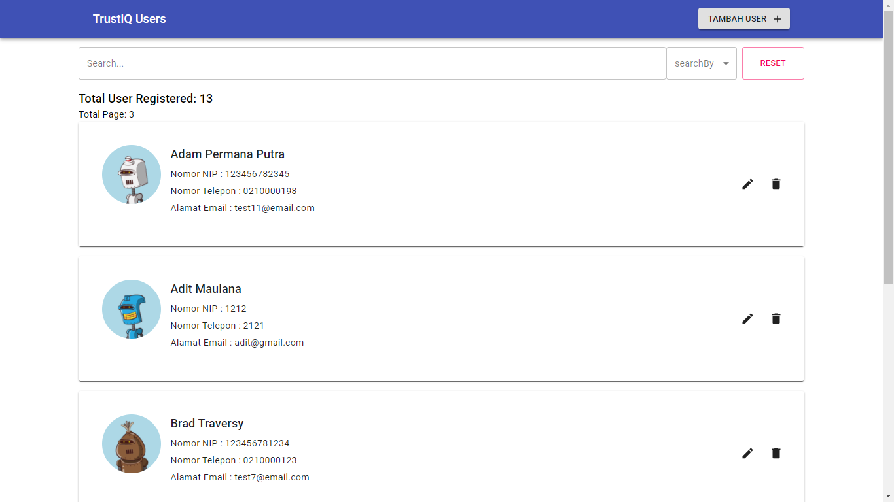
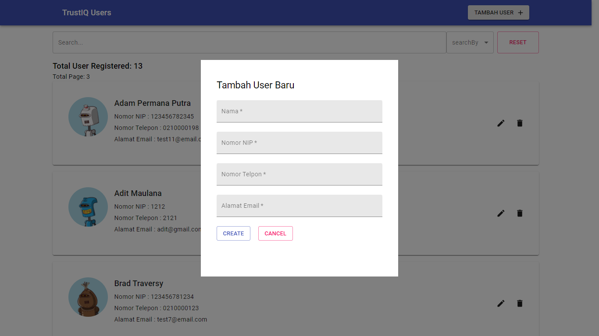
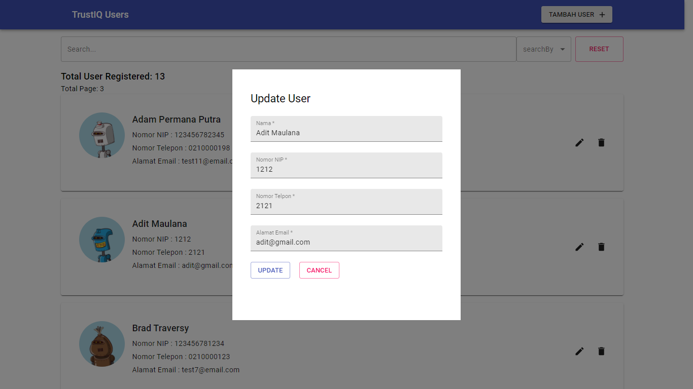

Aplikasi frontend, minitest oleh trustIQ

## teknologi yang digunakan

- React JS
- Material-ui
- Context API
- Node JS
- Express JS
- MongoDB

## Screenshot aplikasi

## cara menjalankan

- "npm install" untuk menginstall dependency, di root directory
- "npm start" untuk menjalankan aplikasi

## beberapa permasalahan

- setiap merequest kepada API menggunakan useEffect Hooks, selalu terjadi memory leak yang mengakibatkan aplikasi menjadi lambat, alternatifnya saya menggunakan "window.location.reload", untuk mereload setiap state yg update
- client side pagination yg saya buat tidak terdetek oleh browser location api, karena saya tidak menggunakan library untuk routing, jadi hanya memanipulasi DOM nya saja, tanpa ada track history nya.
